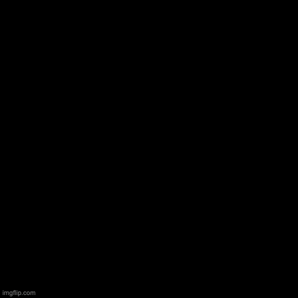
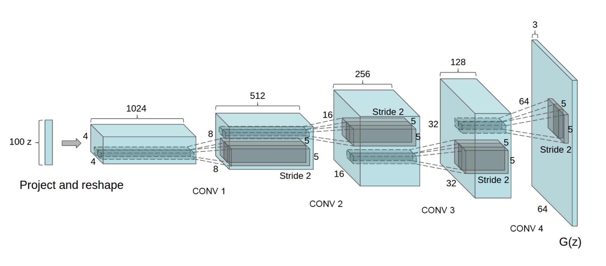

# Deep Convolutional Generative Adversial Network

The generative adversarial network, or GAN for short, was first proposed in 2014. It is an architecture that is tasked with generating synthetic images from a specific distribution of image types.

Training a GAN essentially involves having two models fight against each other to improve. The first model is called a generator, this is what actually generates the synthetic images and what we actually care about after training is complete when making predictions. A generator generates images from latent noise as an input. The second model is called a discriminator, and is simply a binary classifier that discriminates whether an image is fake or real. These two models have opposing goals; the generator wants to generate images to trick the discriminator, and the discriminator wants to discern a real image from a fake image from the generator. In game theory, this represents a zero-sum game, where there exists an optimal solution known as the nash equilibrium. This is achieved by training this one loss function that is minimized from the perspective of the generator, and maximized from the perspective of the discriminator.

Instead of utilizing a vanilla GAN, we used a Deep Convolutional Generative Adversarial Network, or DCGAN. The DCGAN differs from a vanilla GAN in that its generator and discriminator use convolutional and convolutional-transpose layers instead of fully connected linear layers. However, the model’s training process is the same, using latent gaussian noise as an input to generate synthetic images that match the distribution of the real images.

# What went wrong?
1. Trying to place more weight on generator
2. Trying to increase the learning rate of generator over the discriminator
3. Focusing too much on the loss

# What went right?
1. Not giving too much emphasis on the loss and making the learning rate and weights equal for the discriminator and generator

